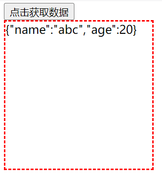
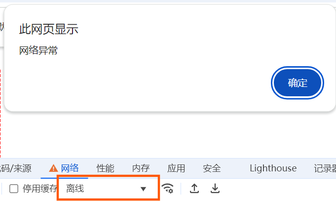
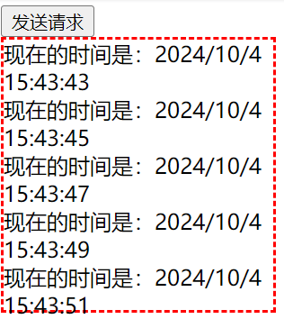

<a id="mulu">目录</a>
<a href="#mulu" class="back">回到目录</a>
<style>
    .back{width:40px;height:40px;display:inline-block;line-height:20px;font-size:20px;background-color:lightyellow;position: fixed;bottom:50px;right:50px;z-index:999;border:2px solid pink;opacity:0.3;transition:all 0.3s;color:green;}
    .back:hover{color:red;opacity:1}
    img{vertical-align:bottom;}
</style>

<!-- @import "[TOC]" {cmd="toc" depthFrom=3 depthTo=6 orderedList=false} -->

<!-- code_chunk_output -->

- [基础概念](#基础概念)
- [原生Ajax](#原生ajax)
    - [基本使用](#基本使用)
    - [发送post请求](#发送post请求)
    - [IE缓存问题](#ie缓存问题)
    - [请求超时与网络异常处理](#请求超时与网络异常处理)
    - [取消请求](#取消请求)
    - [请求重复发送问题](#请求重复发送问题)
- [jQuery中的Ajax](#jquery中的ajax)
    - [get和post方法](#get和post方法)
    - [通用方法ajax](#通用方法ajax)

<!-- /code_chunk_output -->

<!-- 打开侧边预览：f1->Markdown Preview Enhanced: open...
只有打开侧边预览时保存才自动更新目录 -->

写在前面：此笔记来自b站课程[【尚硅谷】3小时Ajax入门到精通](https://www.bilibili.com/video/BV1WC4y1b78y) P1-P / [资料下载](https://pan.baidu.com/s/1BM_OKMXXAGxMNqaBN_7tRg#list/path=%2Fsharelink4035995002-565810062936917%2F%E5%B0%9A%E7%A1%85%E8%B0%B7%E5%89%8D%E7%AB%AF%E5%AD%A6%E7%A7%91%E5%85%A8%E5%A5%97%E6%95%99%E7%A8%8B&parentPath=%2Fsharelink4035995002-565810062936917) 提取码：afyt

### 基础概念
**AJAX**：Asynchronous Javascript And XML 异步的JS和XML
通过AJAX可以在浏览器中向服务器发送异步请求，可以实现**不刷新而获取数据**
**XML**：Extensible Markup Language 可扩展标记语言
用于传输和存储数据，和HTML类似，但XML中没有预定义标签，都是自定义标签，标签的名称和其中的值表示一条数据
```xml
<!-- {"name"": "'abc', "age": 18, "gender": 'male'} -->
<student>
    <name>abc</name>
    <age>18</age>
    <gender>male</gender>
</student>
```
早期的AJAX使用XML作数据传输，现在使用json

---

**优点**：
- 可以无需刷新页面而与服务器进行通信
- 允许根据用户实际来部分更新页面内容

**缺点**：
- 没有浏览历史，不能回退
- 存在跨域问题（默认情况下，a域名的网页不能向b域名的网页发送Ajax请求）
- SEO不友好（页面源代码中没有Ajax请求发送来的数据，爬虫爬不到）
### 原生Ajax
##### 基本使用
共4步：
```js
const xhr = new XMLHttpRequest(); //创建对象
xhr.open(请求方法, 请求url); //初始化，设置请求方法和url
xhr.send(); //发送请求
xhr.onreadystatechange = () => { //事件绑定，处理服务端返回的结果
    if (xhr.readyState === 4) { //当服务器返回了全部结果
        if (xhr.status >= 200 && xhr.status < 300) { //且响应状态正常时
            xhr.status //响应行中的状态码
            xhr.statusText //响应行中的状态字符串
            xhr.getAllResponseHeaders() //响应头的全部信息
            xhr.response //响应体
        }
    }
};
```
注：这部分是作为HTML中普通js代码写的，不是写在node中，也不需使用某个命令执行
- `xhr`是XMLHttpRequest的缩写，是Ajax独有的对象，只要看到它就说明使用了Ajax，浏览器f12的网络network中`Fetch/XHR`就是专门记录Ajax请求的
- 请求方法指get/post/...，请求url是服务端的url，里面还以写查询字符串，如`http://127.0.0.1:9000/server?a=100&b=200&c=300`等，它们都可以用express的`req.query`获取
- `readystate`是xhr对象中的属性，有5个值
  - 0--未初始化（刚声明时）
  - 1--初始化完毕（open方法执行完）
  - 2--已发送（send方法执行完）
  - 3--服务端返回部分结果
  - 4--服务端返回全部结果

  `onreadystatechange`就是当状态改变时触发，因为共有5种状态，所以该事件会触发4次，而我们只在服务器返回全部结果时进行下一步处理，所以要判断状态
- `status`是响应状态码，以2开头的都表示成功，只有响应成功时才进行下一步处理

**例1：建立HTTP服务，并在一个HTML中发送Ajax请求，将响应结果显示在页面中**
- 使用express建立服务，并启动：
    ```js
    const express = require("express");
    const app = express();
    app.get('/server', (req, res) => {
        res.setHeader('Access-Control-Allow-Origin', '*'); //允许跨域
        res.send("hello AJAX"); //响应内容
    });
    app.listen(9000);
    ```
- HTML页面和Ajax请求
    ```html
    <body>
        <button>点击发送请求</button>
        <div id="res"></div>
    </body>
    <script>
        const btn = document.querySelector("button");
        const res = document.querySelector("#res");
        btn.addEventListener("click", () => {
            const xhr = new XMLHttpRequest();
            xhr.open('GET', 'http://127.0.0.1:9000/server');
            xhr.send();
            xhr.onreadystatechange = () => {
                if (xhr.readyState === 4) {
                    if (xhr.status >= 200 && xhr.status < 300) {
                        console.log("响应状态码：", xhr.status);
                        console.log("响应状态字符串：", xhr.statusText);
                        console.log("响应头：", xhr.getAllResponseHeaders());
                        res.innerHTML = xhr.response;
                    }
                }
            };
        });
    </script>
    ```

点击按钮后：
{:width=300 height=300}

---

**例2：处理服务端响应的json格式数据**
- 使用express建立服务，并启动：
    ```js
    const express = require("express");
    const app = express();
    app.get('/server', (req, res) => {
        res.setHeader('Access-Control-Allow-Origin', '*');
        const data = {
            name: "abc",
            age: 20
        };
        res.json(JSON.stringify(data));
    });
    app.listen(9000);
    ```
- HTML页面和Ajax请求：要接收json格式的数据，有两种方法
  - `onreadystatechange`事件中手动转换：`JSON.parse(xhr.response)`
  - （推荐）在声明`xhr`对象后设置响应体数据类型：`xhr.responseType = 'json'`，之后`xhr.response`就为对象形式
    ```html
    <body>
        <button>点击获取数据</button>
        <div id="res"></div>
    </body>
    <script>
        const btn = document.querySelector("button");
        const res = document.querySelector("#res");
        btn.addEventListener("click", () => {
            const xhr = new XMLHttpRequest();
            xhr.open('GET', 'http://127.0.0.1:9000/server');
            xhr.responseType = 'json';
            xhr.send("");
            xhr.onreadystatechange = () => {
                if (xhr.readyState === 4) {
                    if (xhr.status >= 200 && xhr.status < 300) {
                        res.innerHTML = xhr.response;
                        //res.innerHTML = JSON.parse(xhr.response);
                    }
                }
            };
        });
    </script>
    ```

点击按钮后：
{:width=200 height=200}
##### 发送post请求
在`xhr.open`后，事件绑定前：
```js
xhr.setRequestHeader('Content-Type', 请求体类型); //设置请求头
xhr.send(请求体内容);
```
也可以发送自定义请求头，但要更改服务端的路由设置
```js
app.all('/server', (req, res) => {
    res.setHeader('Access-Control-Allow-Origin', '*'); //允许跨域
    res.setHeader('Access-Control-Allow-Headers', '*'); //允许任意请求头
    res.send("hello AJAX"); //响应内容
});
```
为什么用`all`：发送了非预定义的请求头信息，需要进行预检（相当于身份校验），客户端会发送一个类型为`OPTIONS`的请求，只有这个请求被回应后，才能完成自定义请求头的发送

**例**：发送查询字符串、json格式请求体和自定义请求体
```js
/* 服务端 */
const express = require("express");
const body_parser = require("body-parser");
const app = express();
const json_parser = body_parser.json();
const urlencoded_parser = body_parser.urlencoded({ extended: false });
app.all('/json', json_parser, (req, res) => {
    res.setHeader('Access-Control-Allow-Origin', '*');
    res.setHeader("Access-Control-Allow-Headers", "Content-Type,XFILENAME,XFILECATEGORY,XFILESIZE"); //允许json格式请求体
    if (req.body.name) console.log(req.body);
    res.send("hello AJAX json");
});
app.post('/query', urlencoded_parser, (req, res) => {
    res.setHeader('Access-Control-Allow-Origin', '*');
    console.log(req.body);
    res.send("hello AJAX query");
});
app.all('/server', (req, res) => {
    res.setHeader('Access-Control-Allow-Origin', '*');
    res.setHeader('Access-Control-Allow-Headers', '*'); //允许任意请求头
    if (req.get("name")) console.log(req.get("name"));
    res.send("hello AJAX POST");
});
app.listen(9000);
```
```html
<!-- 网页端 -->
<body>
    <button class="query">发送表单格式请求</button>
    <button class="json">发送json请求</button>
    <button class="headers">发送自定义请求头</button>
</body>
<script>
    const query = document.querySelector("button.query");
    const json = document.querySelector("button.json");
    const headers = document.querySelector("button.headers");
    query.addEventListener("click", () => {
        const xhr = new XMLHttpRequest();
        xhr.open('POST', 'http://127.0.0.1:9000/query');
        xhr.setRequestHeader('Content-Type', 'application/x-www-form-urlencoded');
        xhr.send("a=200&b=300");
    });
    json.addEventListener("click", () => {
        const xhr = new XMLHttpRequest();
        xhr.open('POST', 'http://127.0.0.1:9000/json');
        xhr.setRequestHeader('Content-Type', 'application/json');
        xhr.send(JSON.stringify({ name: 'abc', age: 20 }));
    });
    headers.addEventListener("click", () => {
        const xhr = new XMLHttpRequest();
        xhr.open('POST', 'http://127.0.0.1:9000/server');
        xhr.setRequestHeader('name', 'abc');
        xhr.send("发送自定义请求头");
    });
</script>
```
{:width=100 height=100}
[更多关于CORS请求和预检(preflight)](https://blog.csdn.net/think_A_lot/article/details/125528399)
##### IE缓存问题
IE浏览器会缓存服务器响应的结果，导致下一次AJAX请求得到的结果不是服务器响应的最新数据，而是采用上一次缓存的结果
解决方法：在请求url中加上时间戳，使每次的请求url不同
```js
const xhr = new XMLHttpRequest();
xhr.open('GET', 'http://127.0.0.1:9000/server?t=' + Date.now());
xhr.send("");
xhr.onreadystatechange = () => { console.log(xhr.response); };
```
##### 请求超时与网络异常处理
```js
xhr.timeout = ms时间; //经过多少ms后，如果没有响应则取消请求
xhr.ontimeout = ()=>{}; //超时的回调函数
xhr.onerror = ()=>{}; //网络异常的回调函数
```
例：
```js
/* 服务端 */
const express = require("express");
const app = express();
app.get('/timeout', (req, res) => {
    res.setHeader('Access-Control-Allow-Origin', '*');
    setTimeout(() => {
        res.send("timeout");
    }, 3000); //延时3s再响应
});
app.listen(9000);
```
```js
/* 网页端 */
const xhr = new XMLHttpRequest();
xhr.timeout = 2000; //超时2s后取消请求
xhr.ontimeout = () => alert("连接超时");
xhr.onerror = () => alert("网络异常");
xhr.open('GET', 'http://127.0.0.1:9000/timeout');
xhr.send("");
xhr.onreadystatechange = () => { console.log(xhr.response); };
```
{:width=300 height=300}
如何测试网络异常的效果：
{:width=200 height=200}
{:width=200 height=200}
##### 取消请求
在发送请求后，得到服务器响应前，可以手动取消请求
方法：`xhr.abort()`
**例：发送请求后，点击另一个按钮取消请求**
服务端仍用上面的延时3s，要不没时间点取消
```html
<!-- 网页端 -->
<body>
    <button class="send">发送请求</button>
    <button class="cancel">取消请求</button>
</body>
<script>
    const send = document.querySelector("button.send");
    const cancel = document.querySelector("button.cancel");
    let xhr = null; //在外面声明xhr，要不两个点击事件作用域不同
    send.addEventListener("click", () => {
        xhr = new XMLHttpRequest();
        xhr.open('GET', 'http://127.0.0.1:9000/server');
        xhr.send("");
    });
    cancel.addEventListener("click", () => {
        if (xhr) xhr.abort();
    });
</script>
```
{:width=200 height=200}
##### 请求重复发送问题
即短时间多次发送重复请求，使服务器压力过大
解决思路：节流阀，当发送时上锁，收到响应结果时解锁
**例：服务器延迟2s响应，该过程中不能重复发送请求**
```js
/* 服务端 */
const express = require("express");
const app = express();
app.get('/server', (req, res) => {
    res.setHeader('Access-Control-Allow-Origin', '*');
    setTimeout(() => {
        res.send(`现在的时间是：${(new Date()).toLocaleString()}`);
    }, 2000); //延时2s再响应
});
app.listen(9000);
```
```html
<!-- 网页端 -->
<body>
    <button class="send">发送请求</button>
    <div id="res"></div>
</body>
<script>
    const send = document.querySelector("button.send");
    const res = document.querySelector("#res");
    let have_sent = false; //是否已经发送请求
    send.addEventListener("click", () => {
        if (have_sent) return; //如果已经发送就退出
        have_sent = true; //正在发送，上锁
        const xhr = new XMLHttpRequest();
        xhr.open('GET', 'http://127.0.0.1:9000/server');
        xhr.send("");
        xhr.onreadystatechange = () => {
            if (xhr.readyState === 4) {
                if (xhr.status >= 200 && xhr.status < 300) {
                    res.innerHTML += (xhr.response + '<br>');
                    have_sent = false; //解锁
                }
            }
        };
    });
</script>
```
如图，一直点击发送请求按钮，也是每隔2s发送一次（等到服务器响应之后再发送下一次）
{:width=200 height=200}
### jQuery中的Ajax
##### get和post方法
**get请求**：`$.get(url, [data], [callback], [type])`
**post请求**：`$.post(url, [data], [callback], [type])`
- `url`请求地址
- `data`请求携带的查询字符串(get)或表单数据(post)，以对象形式（键值对）传入
- `callback`成功得到响应数据时执行，该回调函数接收一个参数，是响应体
- `type`响应体类型，取值有`xml`、`html`、`script`、`json`、`text`（默认）

**例**：
```js
/* 服务端 */
const express = require("express");
const body_parser = require("body-parser");
const app = express();
const urlencoded_parser = body_parser.urlencoded({ extended: false });
app.get('/jq', (req, res) => {
    res.setHeader('Access-Control-Allow-Origin', '*');
    const { a, b } = req.query;
    res.json({
        url: req.url,
        new_a: a * 10,
        new_b: b * 10
    });
});
app.post('/jq', urlencoded_parser, (req, res) => {
    res.setHeader('Access-Control-Allow-Origin', '*');
    res.send(`请求url为"${req.url}"，数据为"${JSON.stringify(req.body)}"`);
});
app.listen(9000);
```
```html
<!-- 网页端 -->
<body>
    <button class="get">发送get请求</button>
    <button class="post">发送post请求</button>
</body>
<script crossorigin="anonymous" src="https://cdn.bootcss.com/jquery/3.4.1/jquery.min.js"></script>
<script>
    $(".get").click(() => {
        $.get(
            'http://127.0.0.1:9000/jq',
            { a: 100, b: 200 },
            data => console.log(data),
            'json'
        );
    });
    $(".post").click(() => {
        $.post(
            'http://127.0.0.1:9000/jq',
            { name: 'abc', age: 20 },
            data => console.log(data),
            "text"
        );
    });
</script>
```
{:width=150 height=150}
##### 通用方法ajax
```js
$.ajax({
    url: 请求url,
    data: 请求携带的参数（同get和post方法）,
    type: 请求类型('GET'/'POST'),
    success: 成功得到响应数据的回调函数，也是接收一个参数作为响应体数据,
    dataType: 响应体数据类型,
    timeout: 超时时间,
    error: 响应失败的回调函数,
    headers: 请求头（对象形式）
});
```
**例**：
```js
/* 服务端 */
const express = require("express");
const app = express();
app.post('/jq', (req, res) => {
    res.setHeader('Access-Control-Allow-Origin', '*');
    setTimeout(() => {
        res.send();
    }, 2000);
});
app.all('/jq', (req, res) => {
    res.setHeader('Access-Control-Allow-Origin', '*');
    res.setHeader('Access-Control-Allow-Headers', '*');
    const { a, b } = req.query;
    res.json({
        url: req.url,
        my_header: req.get("my_header"),
        new_a: a * 10,
        new_b: b * 10
    });
});
app.listen(9000);
```
```js
/* 网页端 */
$(".get").click(() => {
    $.ajax({
        type: 'GET',
        url: 'http://127.0.0.1:9000/jq',
        data: { a: 100, b: 200 },
        dataType: 'json',
        success: data => console.log(data),
        headers: { my_header: 'abc' }
    });
});
$(".post").click(() => {
    $.ajax({
        type: 'POST',
        url: 'http://127.0.0.1:9000/jq',
        timeout: 1000,
        error: err => console.log(err.statusText)
    });
});
```
{:width=150 height=150}
