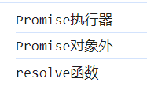
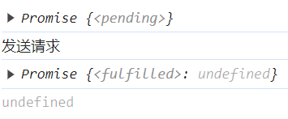
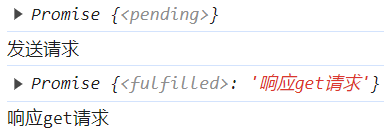
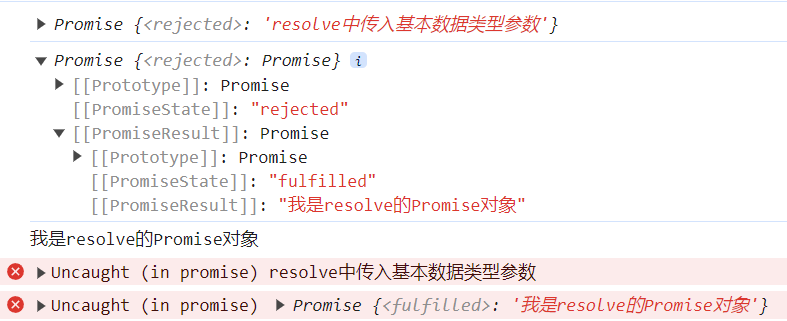
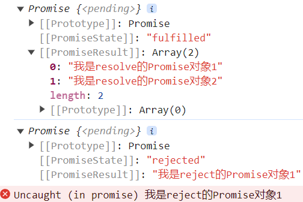
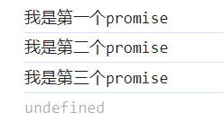

<a id="mulu">目录</a>
<a href="#mulu" class="back">回到目录</a>
<style>
    .back{width:40px;height:40px;display:inline-block;line-height:20px;font-size:20px;background-color:lightyellow;position: fixed;bottom:50px;right:50px;z-index:999;border:2px solid pink;opacity:0.3;transition:all 0.3s;color:green;}
    .back:hover{color:red;opacity:1}
    img{vertical-align:bottom;}
</style>

<!-- @import "[TOC]" {cmd="toc" depthFrom=3 depthTo=6 orderedList=false} -->

<!-- code_chunk_output -->

- [基础部分](#基础部分)
    - [promise简介](#promise简介)
    - [基本使用](#基本使用)
      - [promise的状态和结果值](#promise的状态和结果值)
      - [工作流程](#工作流程)
    - [其它常用API](#其它常用api)
      - [catch](#catch)
      - [resolve和reject](#resolve和reject)
      - [all和race](#all和race)
    - [util包的promisify方法](#util包的promisify方法)
- [Promise的实现过程](#promise的实现过程)
    - [关键问题](#关键问题)
    - [实现过程](#实现过程)
- [async和await](#async和await)
    - [async函数](#async函数)
    - [await表达式](#await表达式)
    - [综合使用](#综合使用)

<!-- /code_chunk_output -->

<!-- 打开侧边预览：f1->Markdown Preview Enhanced: open...
只有打开侧边预览时保存才自动更新目录 -->

写在前面：此笔记来自b站课程[尚硅谷Web前端Promise教程从入门到精通](https://www.bilibili.com/video/BV1GA411x7z1) / [资料下载](https://pan.baidu.com/s/1BM_OKMXXAGxMNqaBN_7tRg#list/path=%2Fsharelink4035995002-565810062936917%2F%E5%B0%9A%E7%A1%85%E8%B0%B7%E5%89%8D%E7%AB%AF%E5%AD%A6%E7%A7%91%E5%85%A8%E5%A5%97%E6%95%99%E7%A8%8B&parentPath=%2Fsharelink4035995002-565810062936917) 提取码：afyt
### 基础部分
##### promise简介
ES6提供的异步编程解决方案（原来使用的都是回调函数），是一个构造函数，用来封装一个异步操作并可以获取其成功/失败的结果值
**最大的特点**：支持==链式调用==，解决==回调地狱==问题——即回调函数多层嵌套，外部回调函数异步执行的结果是内层回调执行的条件，不便于阅读和异常处理
**解决方法**：使用更灵活的方式指定回调函数。原来必须在启动异步任务前指定回调函数，而promise是先启动异步任务->返回promise对象->给promise对象绑定回调函数（可在异步任务结束后指定多个）
##### 基本使用
```js
const p = new Promise((resolve, reject) => {
    resolve(value);
    reject(reason);
}
p.then((value)=>{}, (reason)=>{});
```
- promise是一个构造函数，`new Promise()`是实例化过程，`p`就是创建的示例对象
- 该构造函数接收一个回调函数，被称为**执行器函数**，其中有两个形参，都是函数类型，通常情况下（默认规则）：
  - `resolve`当异步任务成功时调用
  - `reject`当异步任务失败时调用

  这两个函数都可以接收0或1个参数，并将这个参数传给下面的then；如果不想传参，也可以省略不写
- `p.then`接收两个函数——`onResolved()`和`onRejected()`，分别对应上面的`resolve`和`reject`（相当于把成功/失败时执行的函数移到then中来写），最后返回一个新的promise对象，因此下面两段代码是不相同的
    ```js
    const p = new Promise((resolve, reject) => {
        resolve('ok');
    });
    p.then(value => console.log(value));
    console.log(p);
    /*-----------------*/
    const p = new Promise((resolve, reject) => {
        resolve('ok');
    }).then(value => console.log(value));
    console.log(p);
    ```
    第二段代码的p实际上是then方法返回的新promise对象，它的值会在[promise的关键问题](#关键问题)中介绍

注：
- 执行器函数是和Promise构造函数同时调用的，即代码执行到创建Promise对象时，会立即运行执行器函数里面的代码；而执行器中的`resolve`和`reject`函数都是异步的，会等到外层代码全部执行完再执行（类似于定时器）
    ```js
    new Promise((resolve, reject) => {
        console.log("Promise执行器");
        resolve();
    }).then(() => console.log("resolve函数"));
    console.log("Promise对象外");
    ```
    {:width=70 height=70}
- then里面两个函数的`value`、`reason`类似于`resolve`、`reject`，都是习惯写法，写成别的也可以
- 如果promise的构造函数中使用了异步代码，就不能在其中throw抛出错误，这样无法捕获

**例1：利用promise发送ajax请求**
```js
    document.querySelector(".get").addEventListener("click", () => {
        new Promise((resolve, reject) => {
            const xhr = new XMLHttpRequest();
            xhr.open('GET', 'http://127.0.0.1:9000/server');
            xhr.send();
            xhr.onreadystatechange = () => {
                if (xhr.readyState === 4) {
                    if (xhr.status >= 200 && xhr.status < 300) {
                        resolve(xhr.response);
                    } else {
                        reject(xhr.status);
                    }
                }
            };
        }).then(value => {
            console.log(value);
        }, reason => {
            console.log("发送失败，状态码为" + reason);
        });
    });
```
**例2：将上面的get请求封装成一个函数，接收url作为参数，返回promise对象**
```js
function send_ajax(url) {
    return new Promise((resolve, reject) => {
        const xhr = new XMLHttpRequest();
        xhr.open('GET', url);
        xhr.send();
        xhr.onreadystatechange = () => {
            if (xhr.readyState === 4) {
                if (xhr.status >= 200 && xhr.status < 300) {
                    resolve(xhr.response);
                } else {
                    reject(xhr.status);
                }
            }
        };
    });
}
document.querySelector(".get").addEventListener("click", () => {
    send_ajax('http://127.0.0.1:9000/server')
        .then(value => {
            console.log(value);
        }, reason => {
            console.log("发送失败，状态码为" + reason);
        });
});
```
###### promise的状态和结果值
**状态**：是promise实例对象的一个属性`PromiseState`，有三种可能值：
- `pending`未决定的（初始化时的默认值）
- `resolved`/`fullfilled`成功
- `rejected`失败

因为一个promise对象的状态只能改变一次。所以只有两种可能的状态转换：
- `pending`->`resolved`
- `pending`->`rejected`

这两种状态转变都会有一个**结果值**，也是promise实例对象的一个属性`PromiseResult`，默认为undefined，它只能被上面的`resolve`和`reject`函数修改
事实上，向这两个函数中传入参数，就是修改该属性的值，后面的`value`和`reason`参数就是取出该属性值
以上面的`send_ajax`函数为例：
```js
const p = send_ajax('http://127.0.0.1:9000/server');
console.log(p);
document.querySelector(".get").addEventListener("click", () => {
    console.log("发送请求");
    send_ajax('http://127.0.0.1:9000/server')
        .then(value => {
            console.log(p);
            console.log(value);
        }, reason => {
            console.log(p);
            console.log(reason);
        });
});
```
- 如果不在`resolve`和`reject`中传入参数：
    {:width=100 height=100}
- 如果在`resolve`和`reject`中传入参数：
    {:width=100 height=100}
###### 工作流程
{:width=150 height=150}
- 封装promise对象（pending状态），执行异步操作
- 若成功则执行`resolve()`方法，将promise对象改为resolved状态，之后执行then中的第一个回调`onResolved()`
- 若失败则执行`reject()`方法，将promise对象改为rejected状态，之后执行then中的第二个回调`onRejected()`
- 最后都返回一个**新**的promise对象
##### 其它常用API
###### catch
类似于then方法，只是它只接收失败的回调函数：`p.catch(reason=>{})`
实际上，`p.catch(onRejected)`就是`p.then(null, onRejected)`
```js
new Promise((resolve, reject) => {
    reject("111");
}).catch(reason => console.log("catch失败回调"));
```
###### resolve和reject
`Promise.resolve(value/promise对象)`
- 当传入的参数为非Promise对象时，返回一个状态为成功的Promise对象，其结果值为传入的那个参数`value`
- 当传入一个Promise对象时，该Promise对象的结果决定了函数的返回值，即resolve会将传入的这个Promise对象返回

```js
const p1 = Promise.resolve("resolve中传入非Promise对象值");
const p_resolve = new Promise((resolve, reject) => {
    resolve("我是resolve的Promise对象");
});
p_resolve.then(value => console.log(value), reason => console.log(reason));
const p_reject = new Promise((resolve, reject) => {
    reject("我是reject的Promise对象");
});
p_reject.catch(reason => console.log(reason));
const p2 = Promise.resolve(p_resolve);
const p3 = Promise.resolve(p_reject);
console.log(p1, p2, p3);
console.log(p2 === p_resolve, p3 === p_reject);
```
{:width=100 height=100}

---

`Promise.reject(reason)`返回一个状态为失败的Promise对象，其结果值为传入的那个参数`reason`
注：`reason`不仅可以为基本数据类型，还可以为一个Promise对象，但与上面的resolve不同，reject只会把传入的参数作为新Promise对象的结果值
```js
const p_resolve = new Promise((resolve, reject) => {
    resolve("我是resolve的Promise对象");
});
p_resolve.then(value => console.log(value), reason => console.log(reason));
console.log(Promise.reject("resolve中传入基本数据类型参数"));
console.log(Promise.reject(p_resolve));
```
{:width=200 height=200}
注：报错是因为没给reject返回的Promise对象写then/catch方法，不用在意，下同
###### all和race
`Promise.all(promise_list)`/`Promise.race(promise_list)`：都接收一个元素为Promise对象的数组，并返回一个新的Promise对象
- `all`：
  - 如果传入的Promise数组中有状态为失败的Promise对象，则返回的Promise对象状态也为失败，结果值为数组中第一个失败的Promise对象的结果值
  - 如果都为成功，则返回的Promise状态就为成功，结果值为所有传入的Promise对象的结果值组成的数组，且顺序与传入的顺序相同（不是执行完成的顺序）
- `race`：返回的状态和结果值都取决于数组中第一个状态发生改变的Promise对象

例：`all`
```js
const p_resolve1 = new Promise((resolve, reject) => {
    resolve("我是resolve的Promise对象1");
});
const p_resolve2 = new Promise((resolve, reject) => {
    resolve("我是resolve的Promise对象2");
});
const p_reject1 = new Promise((resolve, reject) => {
    reject("我是reject的Promise对象1");
});
const p_reject2 = new Promise((resolve, reject) => {
    reject("我是reject的Promise对象2");
});
console.log(Promise.all([p_resolve1, p_resolve2]));
console.log(Promise.all([p_resolve1, p_resolve2, p_reject1, p_reject2]));
```
{:width=200 height=200}
注：all如果返回失败的Promise对象，其结果值是取决于第一个状态**变为**失败的Promise对象。如果给上面的`p_reject1`加上一个settimeout，让其比`p_reject2`晚失败，则返回的结果值就是`p_reject2`的
在`race`的例子中可以更清晰的体现这一点：
```js
const p1 = new Promise((resolve, reject) => {
    setTimeout(() => resolve("我是resolve的Promise对象1"), 2000);
});
const p2 = new Promise((resolve, reject) => {
    setTimeout(() => reject("我是resolve的Promise对象2"), 1000);
});
console.log(Promise.race([p1, p2]));
```
{:width=80 height=80}
可以理解成几个Promise在race（赛跑），谁先完成结果就是谁
##### util包的promisify方法
是nodejs的一个模块，用于将“错误优先的回调风格函数”（即以`(err, data)=>{}`回调作为最后一个参数的函数）转为promise风格的版本
**例**：封装一个函数`mine_readfile`读取文件内容，接收参数`path`文件路径，返回promise对象——在读取出错时执行`reject`回调，输出错误信息；读取成功则执行`resolve`回调，输出文件内容
- 正常promise写法：
    ```js
    function mine_readfile(path) {
        return new Promise((resolve, reject) => {
            require("fs").readFile(path, (err, data) => {
                if (err) reject(err);
                else resolve(data);
            });
        });
    }
    mine_readfile(__dirname + '/test.txt')
        .then(value => {
            console.log(value.toString());
        }, reason => {
            console.log(reason);
        });
    ```
- 使用`util.promisify`：
    ```js
    const util = require("util");
    const mine_readfile = util.promisify(require("fs").readFile);
    mine_readfile(__dirname + '/test.txt')
        .then(value => {
            console.log(value.toString());
        }, reason => {
            console.log(reason);
        });
    ```

可以看到，对于其它类似格式的函数，无需手动封装，可以借助util包来转为promise风格的函数
### Promise的实现过程
##### 关键问题
**1. 如何改变promise对象的状态**：
- 前面提到的resolve和reject函数
- 抛出错误`throw value`
    ```js
    const p = new Promise((resolve, reject) => {
        throw 'error';
    });
    p.catch(reason => console.log(reason));
    console.log(p);
    ```
    {:width=100 height=100}

**2.一个promise指定多个成功/失败的回调函数，都会调用吗**
当promise改变为对应状态时都会调用
```js
const p = new Promise((resolve, reject) => {
    resolve('ok');
});
p.then(value => console.log(value + '1'));
p.then(value => console.log(value + '2'));
p.then(value => console.log(value + '3'));
console.log(p);
```
{:width=120 height=120}
**3. 改变promise状态和指定回调函数的先后顺序**
即“promise对象中调用resolve和reject”--“使用p.then/catch方法指定回调”谁先执行
- 都有可能
  - 如果改变状态函数被写到异步任务（例如定时器），就是先指定回调再改变状态
  - 如果改变状态函数被写到同步任务（顺序执行的代码），就是先改变状态再指定回调
- **如何先改变状态再指定回调**：除了上面提到的同步任务，还可以让then方法延时更长时间执行
- **什么时候可以得到数据（执行回调）**：当状态改变和指定回调都完成时才会执行回调

注：指定回调不是执行回调，指定回调是then方法被执行，执行回调是then方法中的两个参数（回到函数）被执行
**4. `p.then`返回新promise对象的结果状态由什么决定**
- 简单来说，由then指定回调函数执行的结果决定
- 具体来说，如果then中执行的回调函数
  - 回调函数中抛出异常，新promise就是reject状态，结果值是抛出的异常值
  - 回调函数返回非promise值，新promise就是resolved，结果值是返回的值
  - 回调函数返回promise对象，则then就返回一个新promise对象，它的状态和返回值与这个promise对象相同

```js
const p = new Promise((resolve, reject) => {
    resolve('ok');
});
const res1 = p.then(value => { throw ("error") }); //抛出异常
const res2 = p.then(value => { return 'OK' }); //返回字符串
const res3 = p.then(value => console.log('OK')); //无返回值（返回undefined）
const res4 = p.then(value => { //返回一个失败的promise对象
    return new Promise((resolve, reject) => {
        reject(value);
    });
});
console.log(res1, res2, res3, res4);
```
{:width=170 height=170}
**5. 如何串联多个操作任务**
因为then返回promise对象，可以通过then来链式调用串联多个同步/异步任务
```js
const p = new Promise((resolve, reject) => {
    setTimeout(() => resolve('我是第一个promise'), 1000);
});
p.then(value => {
    console.log(value);
    return new Promise((resolve, reject) => {
        setTimeout(() => resolve('我是第二个promise'), 1000);
    });
})
    .then(value => {
        console.log(value);
        return new Promise((resolve, reject) => {
            setTimeout(() => resolve('我是第三个promise'), 1000);
        });
    })
    .then(value => {
        console.log(value);
    })
    .then(value => {
        console.log(value);
    });
```
{:width=100 height=100}
为什么最后是undefined？因为倒数第二个then中回调没返回值，返回的promise对象结果值为undefined
**6. 异常穿透**
当使用then链式调用时，可以在最后指定失败的回调，前面任何promise状态变为失败都会传到最后失败的回调中处理，第一个状态变为失败的promise之后的成功回调将不执行，只执行失败回调
```js
const p = new Promise((resolve, reject) => {
    setTimeout(() => reject('我是第一个失败的promise'), 1000);
});
p.then(value => {
    console.log(value);
    return new Promise((resolve, reject) => {
        setTimeout(() => reject('我是第二个失败的promise'), 1000);
    });
})
    .then(value => {
        console.log(value);
        return new Promise((resolve, reject) => {
            setTimeout(() => resolve('我是第三个promise'), 1000);
        });
    })
    .then(value => {
        console.log(value);
    })
    .catch(reason => { //当然用then也可以
        console.log(reason);
    });
```
输出`我是第一个失败的promise`，中间三个`console.log(value)`成功回调不会执行，直接跳到最后的catch失败回调
```js
const p = new Promise((resolve, reject) => {
    setTimeout(() => resolve('我是第一个的promise'), 1000);
})
    .then(value => {
        console.log(value);
        return new Promise((resolve, reject) => {
            setTimeout(() => reject('我是第一个失败的promise'), 1000);
        });
    })
    .then(value => {
        console.log(value);
    })
    .catch(reason => { //当然用then也可以
        console.log(reason);
    });
```
{:width=50 height=50}
**7. 中断promise链**
方法：在then回调中返回一个pending状态的promise对象
原理：这样then的返回值是pending的promise，状态不改变，后面的回调都不会执行
```js
const p = new Promise((resolve, reject) => {
    setTimeout(() => resolve('我是第一个promise'), 1000);
});
p.then(value => {
    console.log(value);
    return new Promise((resolve, reject) => {
        setTimeout(() => resolve('我是第二个promise'), 1000);
    });
})
    .then(value => { //中断promise链
        return new Promise(() => { });
    })
    .then(value => {
        console.log(value);
        return new Promise((resolve, reject) => {
            setTimeout(() => resolve('我是第三个promise'), 1000);
        });
    })
    .then(value => {
        console.log(value);
    });
```
只输出`我是第一个promise`
##### 实现过程
- **构造函数**：接收executor执行器作参数，之后函数体内定义状态属性`promiseState`和结果值属性`PromiseResult`、以及resolve和reject函数，并同步调用executor执行器函数
    主要问题：如何实现`Promise((resolve, reject)=>{})`格式的参数传递？
    ```js
    function Promise(func){
        function resolve(value){}
        function reject(reason){}
        func(resolve, reject);
    }
    ```
  - resolve和reject函数：两个功能——修改对象状态、设置对象结果值
  - 抛出异常时修改promise对象状态：使用try...catch...结构调用执行器函数
  - 状态只能修改一次：只有状态为pending时才能改状态
- **then方法**：成功就调用onResolved，失败就调用onRejected
    主要问题：使用异步的方法，实现状态改变和指定回调都完成时才会执行回调
    - 状态先改变：直接在then中判断状态来执行对应的回调就行
    - 状态后改变：此时then中获取到的状态仍为pending，可以在then中保存回调函数——在Promise对象上增加一个属性callback，将两个回调函数组成一个对象，保存到它身上；最后在resolve和reject函数中调用对应的回调
- **指定多个回调**：将callback属性声明成一个数组，进行保存时将两个回调函数的对象push进去。在resolve和reject函数中调用时使用foreach遍历
- **then方法的返回值**：将之前then中的代码写进`return new Promise((resolve, reject)=>{})`中，因为Promise对象的executor立即执行，且箭头函数的this穿透，原本的功能可以保留；之后在if状态判断中获取onResolved和onRejected的运行结果，根据这个结果决定到底返回什么
  - 如果是非promise类型，直接调用新创建的promise的resolve方法
  - 如果是promise，调用这个返回的promise对象的then方法（递归），两个回调函数分别为`resolve(value)`和`reject(reason)`，相当于为返回的promise对象添加resolve/reject事件
  - 抛出异常：用trycatch结构包裹上述代码，catch中调用reject函数
  
  异步情况的处理：和上面类似，都是修改状态为pending的处理函数，其实只用把上面状态为fulfilled和rejected的处理函数复制到保存的两个回调函数中就可以了
- **catch方法**：其实直接调then方法，并指定第一个参数为undefined就可以
    主要问题：如果是.then.then.catch结构，then方法没有传失败的回调，只使用catch指定失败回调，那么在储存的回调函数中，有的对象就只有成功回调，失败回调为undefined，如果最后promise状态变为失败就会导致报错
    注：then方法也允许不指定成功回调
    改进方法：在then的return前判断有没有传成功/失败回调，如果没传就设置
    - 失败回调初始值：`reason=>{throw reason;}`
    - 成功回调初始值：`value=>{return value;}`

    相当于将成功/失败结果值层层传下去，为什么一个return一个throw？因为要保证传递时状态不变，throw调的是reject，而return调的是resolve
- **resolve和reject方法**：因为是加在Promise对象而不是实例对象上的，所以用`Promise.resolve`而不是`Promise.prototype.resolve`。对于resolve：实现思路同then，都是判断传入的参数，并创建新Promise对象；而对于reject：直接在新创建的promise对象中reject即可
- **all和race方法**：如何判断每个promise是否成功？调用then方法，如果它执行了第一个回调，就是成功，反之为失败；在all方法中，要设置一个计数变量标识有几个promise成功，一个数组存储成功promise的结果值；race方法直接改变结果promise状态即可

---

补充：
- 一个细节：**then中回调是异步执行的**
    ```js
    const p1 = new Promise((resolve, reject) => {
        console.log(1);
        resolve();
    });
    p1.then(v => {
        console.log(2);
    });
    console.log(3);
    ```
    输出顺序：`1`->`3`->`2`
    **实现方法**：为then的`callback`函数调用添加延时为0的定时器——`this.PromiseState === 'fulfilled'/'rejected'`的两个`callback`以及Promise构造函数中的两个`self.callbacks.forEach`
- 封装成一个类：
    ```js
    class Promise{
        constructor(){} //构造函数
        then(){} //添加到类的实例对象上的方法
        static resolve(){} //添加到类上的方法
    }
    ```
### async和await
##### async函数
使用`async`关键字声明一个函数：
```js
async function 函数名(){
    return xxx;
}
//也可以写成箭头函数的形式↓
//const 函数名 = () => {};
const res = 函数名();
```
类似于then方法，async函数的返回值`res`是一个promise对象
- 如果函数内返回值是一个非promise对象，`res`就是一个成功的promise，结果值为函数返回值
- 如果函数内返回值是一个promise对象，`res`的状态和返回值与这个promise对象相同
- 如果函数内抛出异常，`res`就是reject状态，结果值是抛出的异常值

```js
async function func(value) {
    if (value === 'error') throw 'error';
    return value;
}
console.log(func('error'));
console.log(func());
console.log(func('ok'));
const p1 = new Promise((resolve, reject) => {
    resolve("我是成功的promise对象");
});
const p2 = new Promise((resolve, reject) => {
    reject("我是失败的promise对象");
});
console.log(func(p1));
console.log(func(p2));
```
{:width=400 height=400}
##### await表达式
使用形式：`const res = await 变量`，可以阻塞代码的执行，即必须等待await执行完毕后才会执行下面的代码
**必须写在async函数中**，但async函数中可以没有await
await右侧的变量一般为promise对象，但也可以是其它值
- 如果变量是成功的promise对象，则await返回其结果值
- 如果变量是失败的promise对象，就会抛出异常，需要使用`try...catch(e)...`处理，其中`e`为结果值
- 如果变量是其它值，则直接将此值作为返回值

```js
async function func() {
    const p1 = new Promise((resolve, reject) => {
        resolve("我是成功的promise对象");
    });
    const p2 = new Promise((resolve, reject) => {
        reject("我是失败的promise对象");
    });
    console.log(await 12345); //12345
    console.log(await p1); //我是成功的promise对象
    try {
        const res = await p2;
    } catch (e) {
        console.log(e); //我是失败的promise对象
    }
}
func();
```
##### 综合使用
**例1**：使用异步读取函数依次读取`1.txt`、`2.txt`、`3.txt`的文件内容，并将其拼接在一起，保证顺序不变
- 原来的写法：
    ```js
    const fs = require("fs");
    fs.readFile('./1.txt', (err, data1) => {
        if (err) throw err;
        fs.readFile('./2.txt', (err, data2) => {
            if (err) throw err;
            fs.readFile('./3.txt', (err, data3) => {
                if (err) throw err;
                console.log(data1 + data2 + data3);
            });
        });
    });
    ```
- 使用then：
    ```js
    const fs = require("fs");
    const util = require("util");
    const mine_readfile = util.promisify(require("fs").readFile);
    let res = '';
    mine_readfile('./1.txt')
        .then(value => {
            res += value;
            return mine_readfile('./2.txt');
        }, reason => {
            console.log(reason);
        })
        .then(value => {
            res += value;
            return mine_readfile('./3.txt');
        }, reason => {
            console.log(reason);
        })
        .then(value => {
            res += value;
            console.log(res);
        }, reason => {
            console.log(reason);
        });
    ```
- async和await：
    ```js
    const fs = require("fs");
    const util = require("util");
    const mine_readfile = util.promisify(require("fs").readFile);
    async function func() {
        try {
            const data1 = await mine_readfile('./1.txt');
            const data2 = await mine_readfile('./2.txt');
            const data3 = await mine_readfile('./3.txt');
            console.log(data1 + data2 + data3);
        } catch (e) {
            console.log(e);
        }
    }
    func();
    ```

**例2**：点击按钮发送Ajax请求
```js
/* 服务端 */
const express = require("express");
const app = express();
app.get('/server', (req, res) => {
    res.setHeader('Access-Control-Allow-Origin', '*');
    res.send("响应get请求");
});
app.listen(9000);
```
```js
/* 网页端 */
function send_ajax(url = 'http://127.0.0.1:9000/server') {
    return new Promise((resolve, reject) => {
        const xhr = new XMLHttpRequest();
        xhr.open('GET', url);
        xhr.send();
        xhr.onreadystatechange = () => {
            if (xhr.readyState === 4) {
                if (xhr.status >= 200 && xhr.status < 300) {
                    resolve(xhr.response);
                } else {
                    reject(xhr.status);
                }
            }
        };
    });
}
const get = document.querySelector("button.get");
get.addEventListener("click", async function () {
    try {
        const res = await send_ajax();
        console.log(res);
    } catch (e) {
        console.log(e);
    }
});
```
